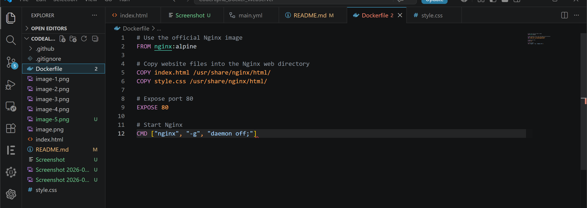
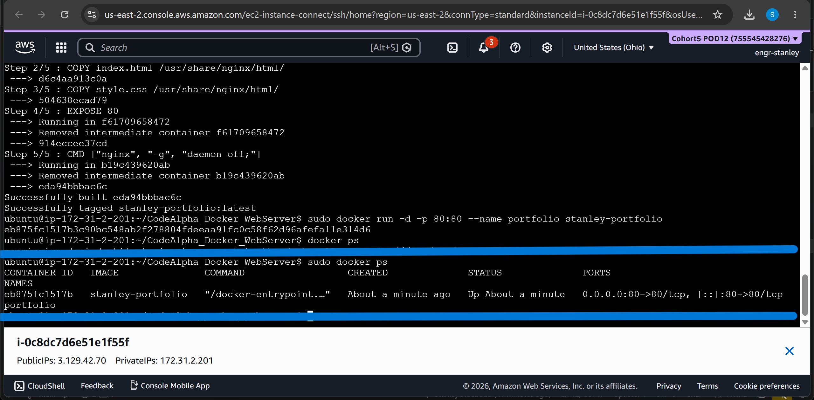
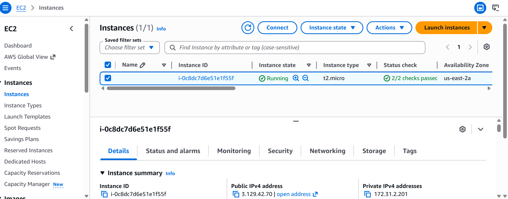
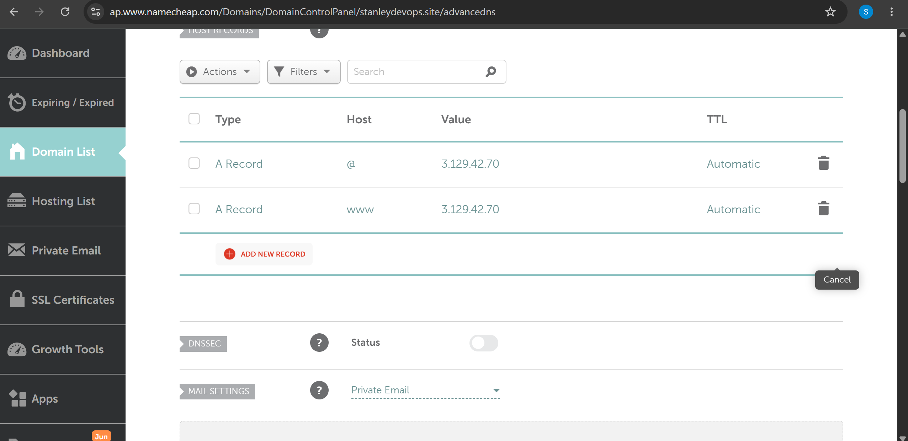
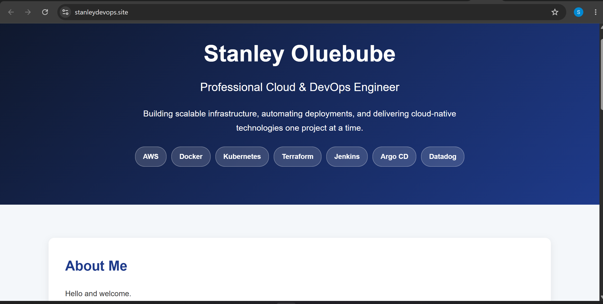

# CodeAlpha DevOps Internship - Task 4

# Containerized Personal Portfolio Website

## Project Overview

This project was completed as part of the CodeAlpha DevOps Internship Program.

The objective was to deploy a web server using Docker. Instead of deploying a simple HTML page, I designed and deployed a professional portfolio website showcasing my DevOps journey and technical skills.

The application was containerized using Docker, hosted on an AWS EC2 instance, connected to a custom domain, and secured with HTTPS using Let's Encrypt SSL certificates.

---

## Live Website

Website URL:

https://stanleydevops.site

---

## Project Architecture

GitHub Repository
↓
AWS EC2 Instance (Ubuntu)
↓
Docker Container
↓
Nginx Reverse Proxy
↓
HTTPS (Let's Encrypt SSL)
↓
Custom Domain (stanleydevops.site)

---

## Technologies Used

* AWS EC2
* Ubuntu Linux
* Docker
* Nginx
* Git & GitHub
* Namecheap DNS
* Let's Encrypt SSL
* HTML5
* CSS3

---

## Features

* Containerized portfolio website using Docker
* Hosted on AWS EC2
* Connected to a custom domain
* HTTPS secured with SSL certificates
* Responsive and professional user interface
* Reverse proxy configuration using Nginx
* Version controlled using Git and GitHub

---

## Deployment Steps

### Step 1: Clone Repository

```bash
git clone https://github.com/stanleyoluebube/CodeAlpha_Docker_WebServer.git
cd CodeAlpha_Docker_WebServer
```

### Step 2: Build Docker Image

```bash
docker build -t stanley-portfolio .
```

### Step 3: Run Docker Container

```bash
docker run -d --name portfolio -p 8080:80 stanley-portfolio
```

### Step 4: Configure Nginx Reverse Proxy

Nginx was configured to forward incoming traffic from the domain to the Docker container running on port 8080.

### Step 5: Configure Domain DNS

A Records were configured in Namecheap DNS settings to point the custom domain to the AWS EC2 public IP address.

### Step 6: Enable HTTPS

SSL certificates were generated using Certbot and Let's Encrypt to secure the website.

---


### Project Structure Screenshots

[html screenshot](<Screenshot 2026-05-31 052726.png>) 

### Docker Image Build

[docker build screenshot](image-5.png) 

### Running Docker Container

[docker images](image-7.png) 

### AWS EC2 Instance



### DNS Configuration



### Live Website



### HTTPS Enabled


---

## Challenges Faced

During deployment, a port conflict occurred because both Nginx and Docker attempted to use port 80 simultaneously.

This issue was resolved by:

* Running the Docker container on port 8080
* Configuring Nginx as a reverse proxy
* Routing HTTPS traffic securely to the container

This provided a more production-ready architecture.

---

## Key Skills Demonstrated

* Docker Containerization
* Linux Administration
* Cloud Infrastructure Deployment
* Domain Management
* DNS Configuration
* HTTPS & SSL Implementation
* Reverse Proxy Configuration
* Git Version Control
* AWS Cloud Computing

---

## Future Improvements

* Implement CI/CD using GitHub Actions
* Deploy using Infrastructure as Code (Terraform)
* Add Monitoring using Datadog
* Migrate to Kubernetes
* Add automated Docker image deployment pipeline

---

## Author

Stanley Oluebube

Cloud & DevOps Engineer

GitHub:
https://github.com/stanleyoluebube

Website:
https://stanleydevops.site

#