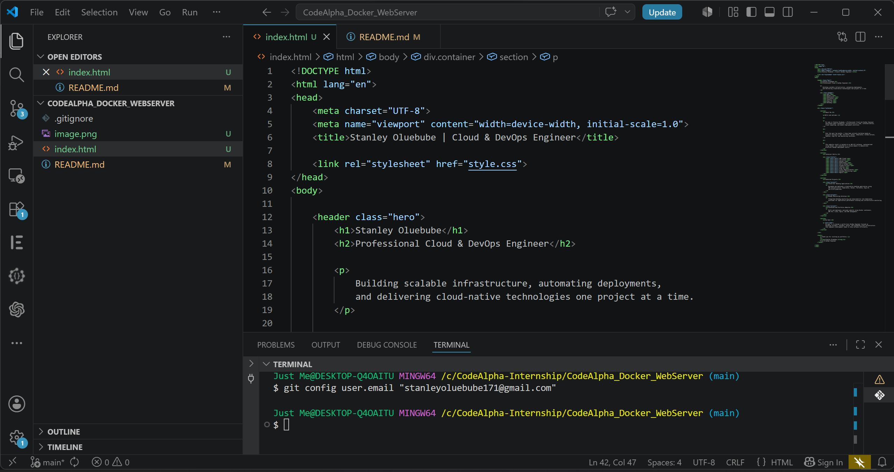

# Step 1: Creating the HTML Structure

The first step was creating the website structure using HTML. The HTML file contains the content and layout of the webpage including headings, sections, text content, and other elements displayed on the browser.

### HTML Source Code




### Explanation

- Created the basic webpage structure.
- Added headings and content sections.
- Defined the elements that will be displayed on the webpage.
- Linked the external CSS file for styling.

---

# Step 2: Styling the Website with CSS

After creating the HTML structure, CSS was used to improve the appearance of the website and make it visually appealing.

### CSS Source Code

*Insert Screenshot of CSS Code Here*

Example:


### Explanation

- Added colors and typography.
- Improved spacing and layout.
- Enhanced overall user interface.
- Created a responsive and professional design.

---

# Step 3: Creating the Dockerfile

The Dockerfile was created to containerize the web application and serve it using Nginx.

### Dockerfile

*Insert Screenshot of Dockerfile Here*

Example:


### Explanation

- Used the official Nginx image as the base image.
- Copied HTML and CSS files into the Nginx web directory.
- Exposed port 80 for web traffic.
- Configured the container to serve the website automatically.

Example Dockerfile:

```dockerfile
FROM nginx:latest

COPY . /usr/share/nginx/html

EXPOSE 80